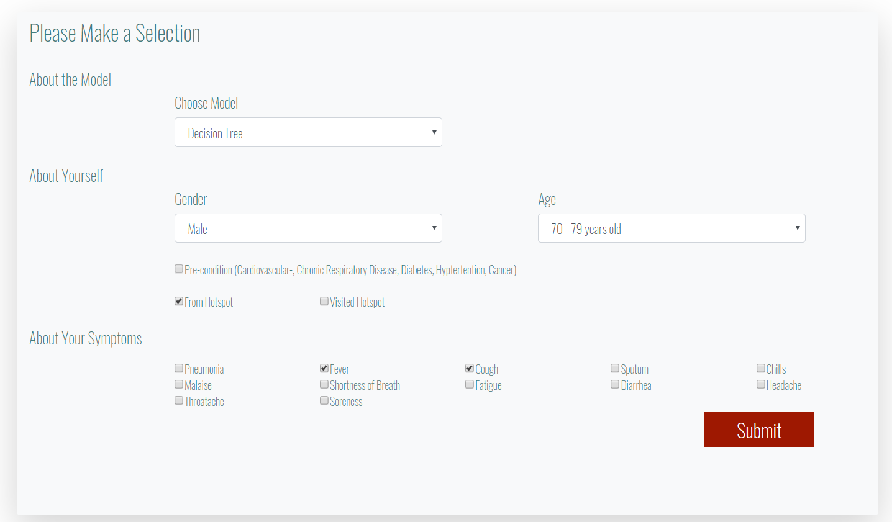
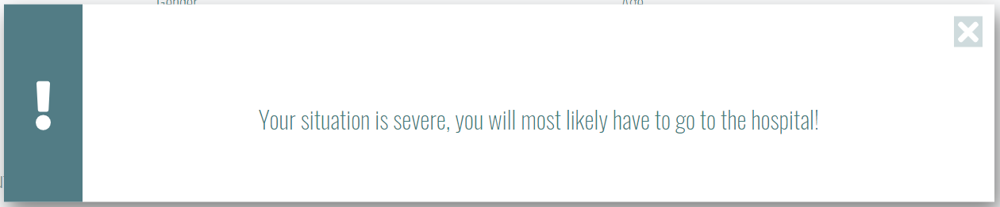
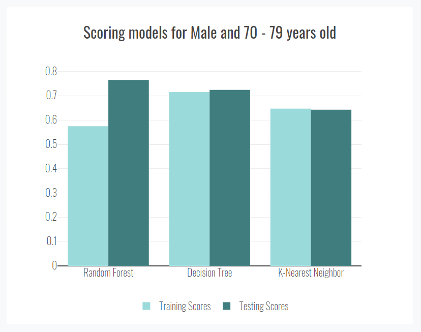
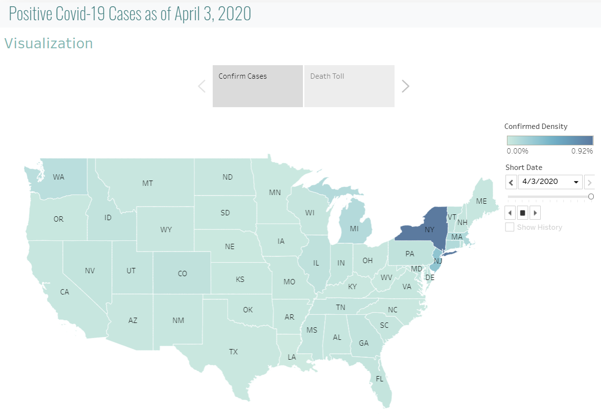
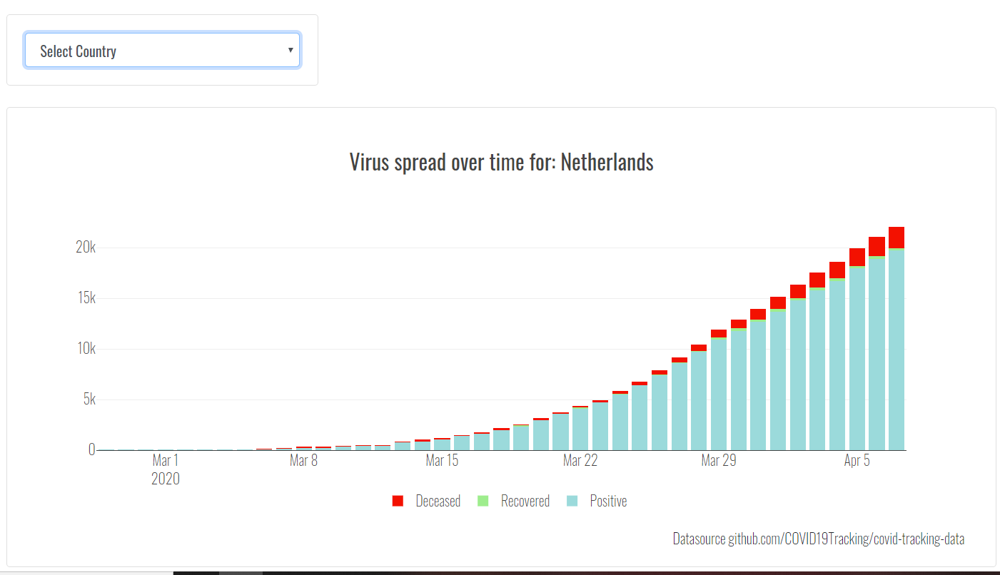
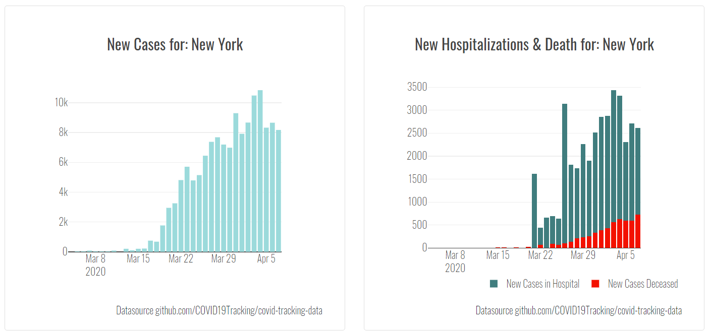

# Project-3 COVID-19 Risk Calculator
By Leo Huang, Joseph Yi, Michael Becker and Aukje Rijpkema 4/8/2020

## About the Risk Calculator

To go to the Heroku app: https://corona-risk.herokuapp.com

The Covid-19 virus for the last few months has caused many people around the world to change their normal habits. It is teaching us to be more observant on the activities we do and the people we meet with. For those who are feeling ill, but do not know if they should go see a doctor may grow in anxiety. 

The Risk Calculator was created to show information on what people may do in regards to symptoms, but as well show only data without the negative externalities of media. 

*Disclaimer*: The application does not provide medical advice, and the models mentioned in the following are not 100% accurate for information on Covid-19 is still dynamic. 

The Risk Calculator uses various machine-learning models to help predict if someone may need to go the doctor to see if they have the virus. The models used for the Risk Calculator are:
* decision-tree model 
* random forest model
* K-nearest neighbors model. 

The models are not 100% accurate, and are still in beta due to the ever changing data incorporated with Covid-19. This is just here to show information.

## Architecture

* PostgreSQL Database	- 6 datasources – 10 views
* Python ETL		- full + delta loads
* Python ML		- 4 models
* FLASK API		- 8 routes – 4 API endpoints
* HTML/CSS/JS 		- frontend web-application
* Tableau			- integrated in web-application
* Heroku			- application deployment

## Functionality

The application is comprised of 6 pages:

* Home Page 		– Race Chart by State
* Risk Calculator Page	– Find out how much you are at risk
* Visualization Page	– Geographic display of spread
* Charts Page		– Statistics by Country, State and County
* About Page		– Our Roles and Profiles
* CDC-site 		– More information

## Home Page

The homepage starts out with a description and disclaimer about the applications. 
An animated so-called race-chart shows confirmed cases per state over time.

## Risk Calculator

A Python script was created to retrieve, transform and load data from 2 datasets on actual COVID-19 cases that came out by the end of January 2019. Eventhough the dataset wasn't filled out consistently as it appears to have been created by a multitude of sources with patients from around the globe, it turned out to be a good starting point for Machine Learning in order to predict the outcome when given an x-number of symptoms and conditions.

datasources:

* ~ 1000 closed cases (mostly hospitalizations + death)
* ~ 14000 open cases (tested positive but never reported back)

Some more cleanup was done using SQL in a Postgres database.
After applying 4 models to predict 3 possible outcomes ('get well at home', 'visit the hospita','death'), the following 3 turned out to be most useful:

* Decision Tree
* Random Forest
* K-Nearest Neighbor

After filling out the form:

... the application will advice based on the chosen model:

... as well a an evaluation based on the submitted gender and age about the performance of the different models:

## Visualization Page

This page used an embedded link to Tableau and plots on a USA map the number of confirmed vs number of deceased cases. On the SQL-server level, COVID-case data is merged with US Census data so that a 'percentage infected' and 'percentage deceased' per state can be calculated within Tableau. To the right a 'play' button allows for animated growth over time.

## Chart Page

The chart page shows cases over time by:
- Country
- State
- County

2 Extra charts on the State level show daily changes in cases to see if the goal of 'flatten the curve' is being achieved for the chosen state.

## About Us

Lastly, links to our LinkedIn pages can be found on the About page

